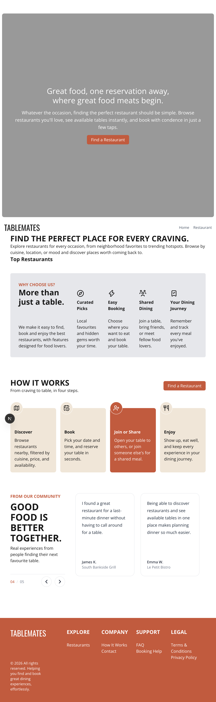

# TableMates

A modern restaurant discovery and booking platform designed to make finding and booking a table simple.

## About

TableMates helps users discover restaurants, explore available dining options, and book a table in just a few steps.

The project focuses on creating a clean and intuitive restaurant booking experience, including location-based discovery and shared dining.

## Features

- 🔎 Discover restaurants by category, location, and availability
- 🗺️ Explore restaurants using an interactive Mapbox map
- 📅 Book restaurants by date, time, and occasion
- 🤝 Join or share an open table with other diners
- 🔐 User authentication with Firebase
- 📖 Track upcoming and previous dining experiences

## Tech Stack

- **React** — Frontend
- **Tailwind CSS** — Styling and responsive UI
- **Firebase Authentication** — User authentication
- **Firestore** — Restaurant and booking data
- **Mapbox** — Interactive restaurant map
- **Material UI Icons** — Interface icons
- **Figma** — UI/UX design and prototyping

## Design

The interface was designed in Figma with a focus on:

- Minimal and modern visual design
- Clear booking flows
- Responsive layouts
- Simple restaurant discovery
- Consistent spacing and typography

## Live Demo

[View TableMates](https://table-mates.vercel.app)

## Author

**Leoni Angela**

Front-End Developer

[Portfolio](https://leoni-angela.vercel.app)