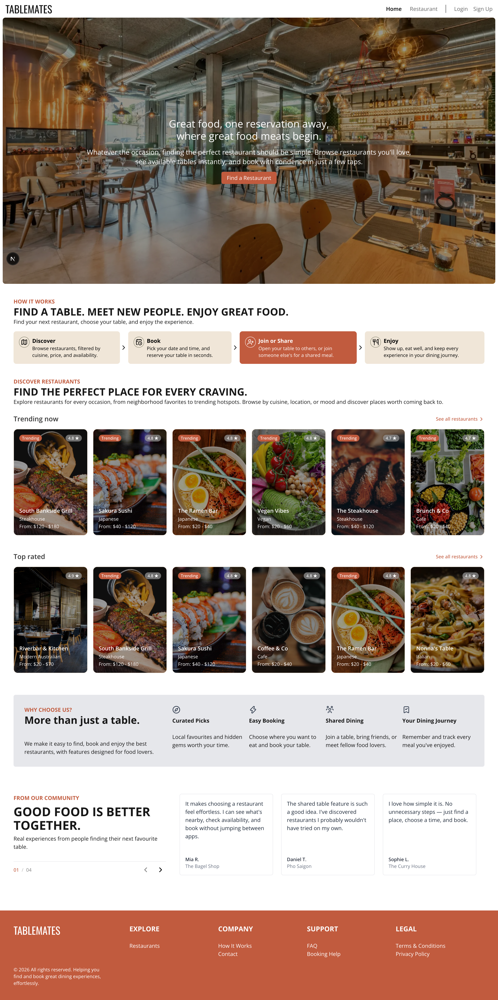

# TableMates

Restaurant discovery and booking, with one twist: a host can open their table to other diners, who can join instantly or ask to join. The hard part isn't the booking form. It's letting strangers share a table safely: seats that can't be double-booked, requests that can't be spammed, blocks that hold even if someone bypasses the UI, and personal details that never leave the host's hands.

**[Live demo](https://table-mates.vercel.app)** · Next.js 16 · React 19 · Firebase · Zustand · Mapbox · Tailwind CSS v4



## What it does

- **Discover:** browse and search every restaurant (not just the loaded page), filter by category, price range, trending and top rated, and see results on an interactive Mapbox map. Filters live in the URL, so a filtered view can be shared or bookmarked.
- **Book:** pick a date, time and seats; only opening times that haven't passed are offered. A booking can repeat weekly, fortnightly or monthly as a series.
- **Share a table:** a booking can be private, open with approval, or open to anyone. Guests join, request to join, ask to change their seat count, or leave. Hosts accept, reject, remove guests, edit seats, or cancel.
- **Stay safe:** block and report other diners, give private post-meal feedback (attended, thumbs up/down, would dine again), and see an aggregate reputation on public profiles.
- **Keep track:** a dining journey of upcoming and past tables, with in-app notifications that update live.

## Architecture

```
app/ (routes)            pages: compose components, own URL state
  └─ components/         UI; components/ui is the shared kit (ModalShell, states, Button)
       ├─ hooks/         data fetching + lifecycle (useRestaurants, useDiningJourney, useDialog…)
       ├─ store/         Zustand: cross-component UI state (map selection, booking modal, notifications)
       └─ services/      the only code that talks to Firestore
            └─ lib/utils pure business rules: seat maths, join eligibility, search, recurring dates
firestore.rules          the real authority: every rule the UI shows is enforced again here
```

Business rules are written once as pure functions and run in two places: in the UI, to explain a disabled button before anyone clicks it, and inside the Firestore transaction against fresh data, where the real decision is made. The security rules then enforce the same invariants a third time, for anyone who skips the app.

## Engineering decisions

**Security rules, not the UI, are the security boundary.** [`firestore.rules`](./firestore.rules) validates every write by shape and by relationship. A few examples:
- A guest joining a public table may only add *themselves*, may not overbook, and is refused if either person has blocked the other.
- Feedback counters on a public profile can only move together with a brand-new feedback doc, by exactly that doc's values (`getAfter` in the same transaction). Owners can never edit their own reputation.
- Admins are listed in `admins/{uid}`, which the client can't write. A role field on the user's own profile could be self-promoted.

**Personal details are split from public data.** Bookings must be publicly readable so open tables are browsable, so the host's name, phone, email and notes live in `bookings/{id}/private/contact`, which only the host can read. The public doc carries only a display name, and the rules reject any booking that tries to store contact fields. Profiles follow the same split: `users/{uid}` is private and `publicProfiles/{uid}` holds only what other diners should see.

**One active join request per table, enforced by a lock document.** Firestore has no unique constraints. A join request must be created in the same transaction as `joinRequestLocks/{bookingId}_{guestId}`, and creating a doc that already exists is an update, which the rules deny. A second concurrent request fails even if the client is modified.

**Seats are derived, never trusted.** Available seats are always recomputed from the host's party and the joined guests ([`table-seats.utils.js`](./src/lib/utils/table-seats.utils.js)) inside a transaction. The client never sends a seat count to be stored as-is, and a table can't be shrunk below the people already sitting at it.

**Working within Firestore's query limits.** Firestore allows range filters on only one field, and every combination of equality filters needs its own composite index. So category is the only server-side filter; price range, trending and top rated are filtered client-side per page. Pagination keeps fetching (up to a cap) until it has a full page of matches, and uses a one-document lookahead so "Load more" never appears when nothing is left ([`restaurantService.js`](./src/services/restaurantService.js)).

**Search without a search service.** Each restaurant stores every prefix of every word in its name and category. A search queries `array-contains` on the longest word and checks the rest client-side, which finds any restaurant in the collection, not just the ones already loaded ([`restaurant-search.utils.js`](./src/lib/utils/restaurant-search.utils.js)).

**The homepage is rendered on the server and cached for an hour.** Ranking restaurants (rating, then review count) compares across documents, which no Firestore query can express, so it needs the whole collection. The homepage is a Server Component with `revalidate = 3600`: the collection is read and ranked at most once an hour, not once per visitor, and the browser receives a few kilobytes of summary rather than every document ([`app/page.js`](./src/app/page.js), [`homepage-summary.utils.js`](./src/lib/utils/homepage-summary.utils.js)). If Firestore is unreachable during regeneration, the read fails loudly (`getDocsFromServer`, not a silent empty cache) and the page fetches in the browser instead.

**Times are the restaurant's, not the viewer's.** A table at "19:00" means 19:00 in Brisbane. Whether a table has started, which slots are left today, and the dining status are all decided on the restaurant's clock ([`restaurant-time.utils.js`](./src/lib/utils/restaurant-time.utils.js)), and the tests run in several time zones to prove it.

**Accessible modals by default.** The app's dialogs are built on `ModalShell`, which uses [`useDialog`](./src/hooks/useDialog.js): focus moves into the dialog, Tab stays inside it, Escape closes only the top dialog when they stack, and focus returns to the trigger on close. Every booking field has a real label, and the visibility choice is a proper radio group. Animations respect `prefers-reduced-motion`.

## Testing

```bash
npm test             # unit tests (Vitest): seat maths, join eligibility, booking form, restaurant time, search, filters, homepage summary
npm run test:rules   # security rules against the Firestore emulator (needs Java 11+)
```

The rules tests check that anonymous users and guests can't read a host's contact details, bookings can't carry contact fields, guests can only add themselves and can't overbook or bypass a block, duplicate join requests are refused, and users can't edit their own reputation.

CI ([`.github/workflows/ci.yml`](./.github/workflows/ci.yml)) runs lint, unit tests and a production build on every push and pull request, and runs the rules tests against the emulator in a separate job.

## Getting started

```bash
npm install
cp .env.example .env   # add your Firebase project and Mapbox token
npm run dev
```

Deploy the security rules with `npx firebase deploy --only firestore:rules --project <your-project-id>`. To load sample restaurants, add your user id to an `admins` collection in the Firebase console, then use the admin tools on your profile page.

## Known limitations and next steps

- **Homepage regeneration reads the whole restaurant collection.** Once an hour rather than per visit, which is fine for a catalogue of hundreds. At tens of thousands, a Cloud Function should maintain the summary document as restaurants change.
- **Counts with client-side filters read every matching document.** A price or trending filter with no category downloads the whole collection to count results. A precomputed price bucket per restaurant would make these server-side queries.
- **One time zone.** Every restaurant is assumed to be in Brisbane. Supporting other cities means storing a time zone per restaurant and passing it through restaurant-time.utils.
- **Restaurants have no page of their own.** A restaurant opens in a panel beside the map; a `/restaurants/[id]` route rendered on the server would give each one a shareable, indexable link with metadata.
- **`communityDiningService.js` is large** (about 1,000 lines) and should be split by flow: joining, requests, hosting.
- **No restaurant capacity.** Any number of tables can be booked in the same time slot. Real availability needs a per-slot seat counter claimed in the same transaction as the booking.
- **Notifications are written by the client.** The rules restrict who can notify whom, but a Cloud Function trigger would be the stronger design.

## Tech stack

| | |
| --- | --- |
| Framework | Next.js 16 (App Router), React 19 with the React Compiler |
| Styling | Tailwind CSS v4, design tokens in `globals.css`, `next/font` |
| State | Zustand (cross-component UI state), React Context (auth), hooks (data) |
| Backend | Firebase Authentication, Cloud Firestore, Firestore security rules |
| Maps | Mapbox GL JS |
| Testing | Vitest, `@firebase/rules-unit-testing` with the Firestore emulator |
| Tooling | ESLint, GitHub Actions, Vercel |
| Icons | lucide-react |

## Image credits

Editorial photography across the site is from [Unsplash](https://unsplash.com), used under the [Unsplash License](https://unsplash.com/license).

| Where | Photo | Photographer |
| --- | --- | --- |
| Homepage hero | [A group of people sitting at a table in a restaurant](https://unsplash.com/photos/a-group-of-people-sitting-at-a-table-in-a-restaurant-xybK6i18C7w) | [Maria Moroz](https://unsplash.com/@mariamoroz) |
| Homepage hero | [A person cooking on a stove with flames](https://unsplash.com/photos/a-person-cooking-on-a-stove-with-flames-tUMUjTr5nq4) | [Julia Vivcharyk](https://unsplash.com/@jusfilm) |
| Homepage: the idea | [White plates with assorted foods](https://unsplash.com/photos/white-plates-with-assorted-foods-Q_Moi2xjieU) | [Stefan Vladimirov](https://unsplash.com/@skv_creates) |
| Homepage band, community dining header | [Long dining table with festive flowers](https://unsplash.com/photos/long-dining-table-with-festive-flowers-fb0_wj2MZk4) | [M F](https://unsplash.com/@mfe1) |
| Homepage closing, log in / sign up / reset password | [People raising wine glasses](https://unsplash.com/photos/people-raising-wine-glass-in-selective-focus-photography-ULHxWq8reao) | [Al Elmes](https://unsplash.com/@alelmes) |
| Homepage how it works, dining journey header | [Lighted lamps in room](https://unsplash.com/photos/lighted-lamps-in-room-8l_RuuZrOyY) | [takahiro taguchi](https://unsplash.com/@tak_tag) |

Restaurant photos in listings, cards and details come from the restaurant data in Firestore.

## Author

**Leoni Angela**, Front-End Developer. TableMates is a portfolio project designed and built by Leoni Angela.

- [Portfolio](https://leoni-angela.vercel.app)
- [GitHub](https://github.com/leonyangela)
- [LinkedIn](https://www.linkedin.com/in/leoni-angela/)
